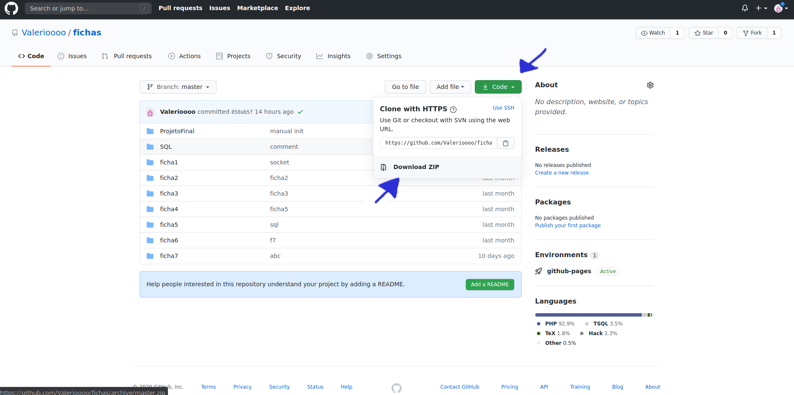
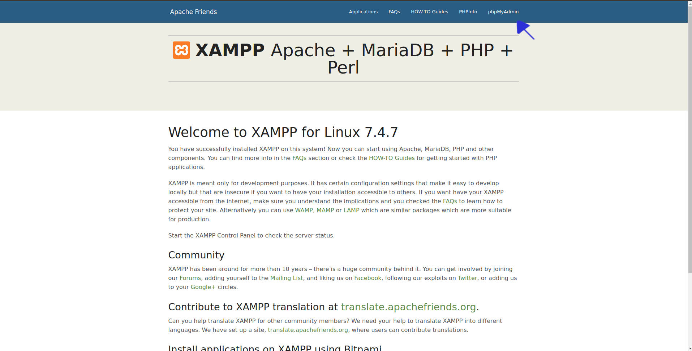

# Manual de Utilizador
---

<!-- TOC -->

- [Introdução](#introdução)
  - [Pré-Requisitos](#pré-requisitos)
  - [Instalação do Xampp](#instalação-do-xampp)
    - [Ficheiros do Site](#ficheiros-do-site)
      - [Transferir .zip](#transferir-zip)
      - [Git clone](#git-clone)

<!-- /TOC -->


## Introdução

Este manual vai explicar como visualizar o site e como trabalhar com o mesmo.

## Pré-Requisitos
Para conseguir visualizar o site é necessário:

* Browser web (Chrome/Firefox/Edge)
* Xampp
* Ficheiros do Site
* git (caso escolha o metodo de instalação por git clone)

## Instalação do Xampp
A Instalação do Xampp é efetuada fazendo a transferencia do [ficheiro de instalação](https://www.apachefriends.org/download.html) indicado para o seu sistema operativo e seguir as instruções de instalação de acordo com o seu sistema operativo.

__Windows__ - Executar ficheiro com a extensão .exe.

__MacOS__ - Abrir ficheiro .dmg e arrastar o mesmo para a pasta Aplicações.

__Linux__ - Executar o ficheiro .run

## Ficheiros do Site

Os ficheiros do site encontram-se [neste](https://github.com/Valerioooo/fichas) repositório do github e existem duas maneiras de os obter.

### Transferir .zip

Transfira o ficheiro .zip carregando no botão __Code__ e em seguida no botão __Download Zip__



Extraia os ficheiro .zip para:

__Windows__ - ```C:\xampp\htdocs\``` (caso tenha instalado o xampp neste local)

__MacOS__  - ```/opt/lampp/htdocs/```

__Linux__ - ```/opt/lampp/htdocs/```

Em seguida Renomeie a pasta de "fichas-master" para "fichas"

### Git clone

Abra o terminal/linha de comandos como **root**/**administrador** e escreva:

__Windows__
```batch
cd C:\xampp\htdocs\
git clone https://github.com/Valerioooo/fichas.git

```

__MacOS__
```bash
cd /opt/lampp/htdocs/
git clone https://github.com/Valerioooo/fichas.git

```


__Linux__
```bash
cd /opt/lampp/htdocs/
git clone https://github.com/Valerioooo/fichas.git

```

## Iniciar Xampp
Para o site poder ser visualizado normalmente é preciso que o Xampp esteja iniciado para isso faça o seguinte:

__Windows__ - Abra o Xampp pelo atalho do menu iniciar e carrege em no botão "_start all_"


__MacOS__
```bash
sudo /opt/lampp/lampp start

```


__Linux__
```bash
sudo /opt/lampp/lampp start

```

## Base de dados

Se não possuir uma base de dados já criada tem de criar uma utilizando uma ferramenta de manipulação de base de dados. Neste exemplo iremos utilizar o _phpMyAdmin_, pois este vem pré instalado com o Xampp:

1. Abra o Browser web.

2. Escreva no url "localhost".
3. Carregue no botão _phpMyAdmin_.

4. Abra a pasta "sql" dentro da pasta ProjetoFinal
5. Copie e cole o conteúdo dos ficheiros 1.sql, 2.sql e 3.sql pela mesma ordem para a aba "__SQL__" no _phpMyAdmin_ carregando no botão "__Go__" por cada ficheiro copiado.
6. A base de dados está criada!
